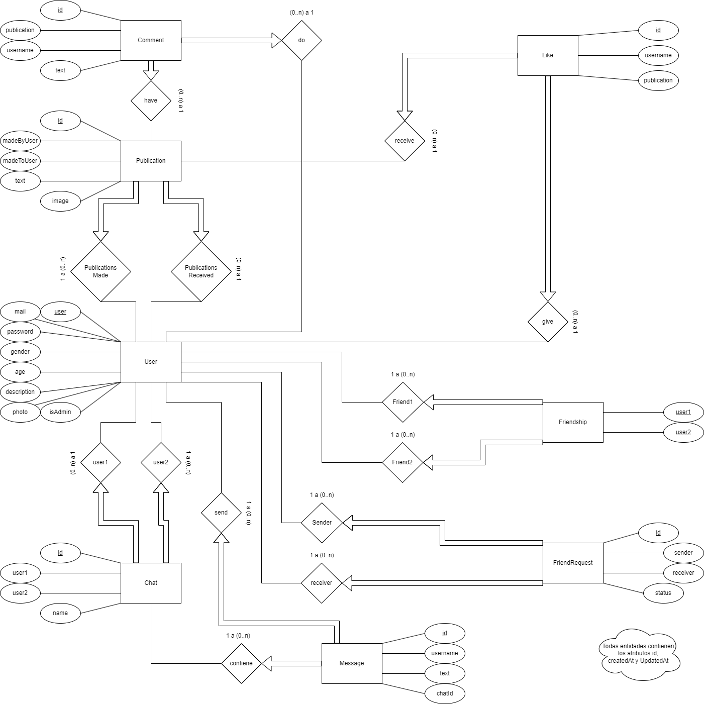
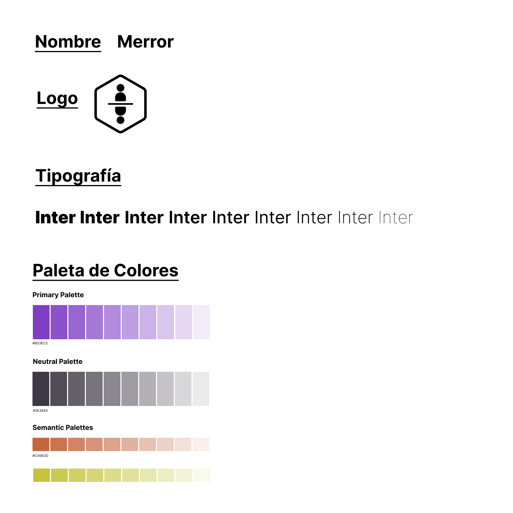
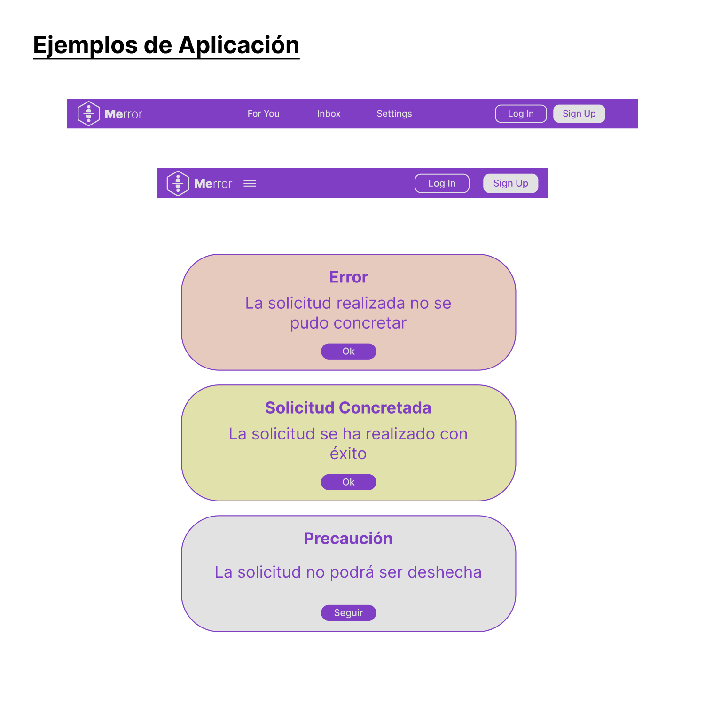
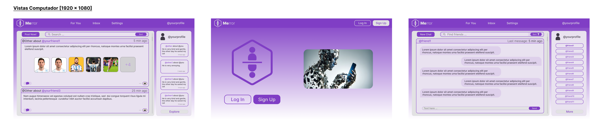
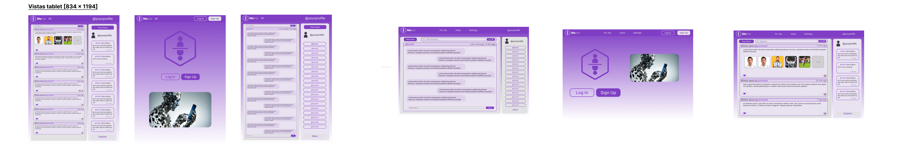
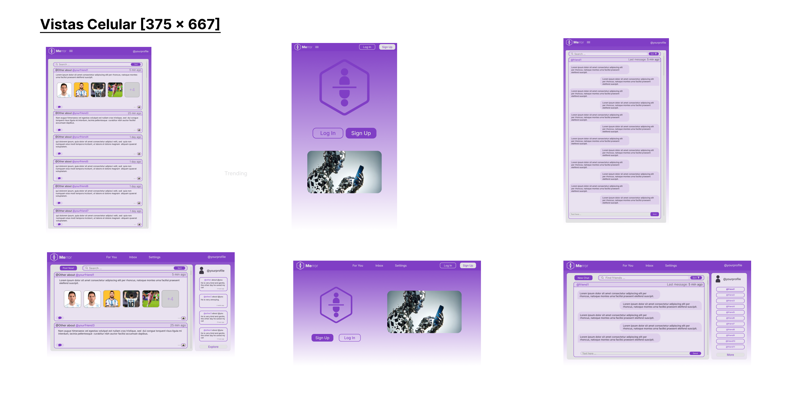

# Web_Ones_Fake_frontend

* :pencil2: **Nombre Grupo:** Web Ones Fake

## Link Netlify
https://jocular-queijadas-ed8119.netlify.app/

## Descripción general :thought_balloon:

### Temática Distintiva:

Ser lo más REAL posible

#### Porque es Importante:

El "23% de las niñas y jóvenes de edades entre 10 y 17 años ‘no se ven lo suficientemente bien’ sin editar sus fotos, mientras que el 20% se siente decepcionado por no tener el mismo aspecto en la vida real que en sus fotos de Internet. Además, el 69% de las niñas aseguran que intentan cambiar u ocultar al menos una parte de su cuerpo cuando se van a hacer una foto para sus redes sociales." (BBVA, 2023) (estudio de Dove s.f.) Y estas tristes estadísticas son tan solo algunas de las que podemos encontrar al buscar información al respecto. Puesto que si nos adentramos veremos que la edad de realización de la primera cirugía plástica se ha reducido; esto debido al uso de filtros de cambio de nariz, de ojos, entre otros... También ocurre que los adolescentes se comparan con cuerpos desarrollados de adultos lo que promueve la hipersexualización en la infancia. (Ágatha de Santos, 2023)

En síntesis, al nosotros poder elegir la foto "perfecta", el momento donde nos sentimos "mejor" en el día estamos generando como sociedad una burbuja de perfección difícil de alcanzar para adolescentes, e incluso adultos jóvenes. Más aún, con el aumento de influencers qué pueden marcar tendencias o metas no sanas para jóvenes que sin la madurez suficiente siguen consejos, tips o dietas que a final de cuentas pueden no ser sanas para ellos.

#### Soluciones existentes

Como jóvenes vimos el boom de BeReal, aplicación que consistía en subir una foto sin filtro por ambos lados en un momento cualquiera del día para así capturarlos en lo que hacemos cotidianamente "sin mentir". El problema es que su fama duró poco, como si de un trend de tik tok se tratase. Por esto mismo, buscamos ser una red social que se quedé en los jóvenes como instagram pero que los impulse a vivir de forma sana su niñez. No como las actuales grandes redes sociales y su constante vulneración de derechos infantiles:

https://www.infobae.com/estados-unidos/2024/01/31/mark-zuckerberg-pidio-disculpas-a-los-padres-de-victimas-de-abuso-infantil-en-una-dura-sesion-en-el-congreso-de-eeeuu/

### Nuestra solución

Una red social con perfil editable, muros con publicaciones y comentarios, chat y una página principal donde interactuar solo con quien eres amigo.

#### ¿Qué lo hace diferente? suena igual que todas :/

Lo que distinguirá esta red social de las otras es que no puedes postear nada en tu perfil. Tan solo tus AMIGOS podrán hacerlo, de esta forma si un dia te juntas con tu mejor amigo a jugar a la pelota el no podrá subir su historia diciendo que se pasó a todos y marcó 10 goles, si no que tu subiras en tu muro un mensaje de lo bien que la pasaron jugando y una foto del tercer tiempo.

De esta forma buscamos incentivar un ambiente donde seamos más reales con lo que hacemos en nuestro dia a dia, como nos vemos, con quien nos relacionamos y con lo que somos realmente; seres humanos disfrutando la vida.

#### Porque es necesario buscar espacios para jóvenes en redes sociales

Defendemos el uso de redes sociales en adolescentes, puesto que se hallan inmersos en el siglo 21, con una sociedad que vive conectada y no se pueden quedar atrás. Menos aún desperdiciar la gran oportunidad que tienen en sus celulares de pasar un buen rato con sus amigos y familiares.

Por esto mismo aquellos jóvenes serán nuestro público objetivo.

### BiBliografía:

https://www.bbva.com/es/sostenibilidad/adolescentes-y-filtros-en-redes-sociales-un-juego-inocente-o-un-riesgo-para-la-autoestima/

https://www.epe.es/es/sociedad/20230825/filtros-redes-sociales-reconocerse-espejo-91323098

## Historia de Usuarios :busts_in_silhouette:

1. Lectura de Información sobre la Pagina:

**Como** usuario,
**Quiero** poder navegar por páginas de información de la app,
**Para que** pueda tener conocimiento de cómo funciona, quien la hizo e información adicional.

2. Registro y Creación de Perfil:

**Como** un nuevo usuario,
**Quiero** registrarme fácilmente en la aplicación,
**Para que** pueda iniciar sesión y entrar a la app.

3. Inicio de Sesión:

**Como** usuario registrado,
**Quiero** iniciar sesión fácilmente en la aplicación con mis datos registrados,
**Para que** pueda crear mi perfil y empezar a interactuar en la red social.

4. Customización de Perfil:

**Como** usuario iniciado
**Quiero** poder editar mis datos, biografía y perfil en general
**Para que** mis amigos puedan identificarme y saber más sobre mí.

5. Añadir y Aceptar Amigos:

**Como** usuario iniciado,
**Quiero** poder buscar y añadir amigos,
**Para que** ellos puedan publicar en mi perfil y yo en el suyo.

6. Publicar en el Perfil de un Amigo:

**Como** usuario iniciado,
**Quiero** publicar fotos y mensajes en el perfil de mis amigos,
**Para que** pueda compartir momentos y experiencias con ellos.

7. Moderación de Contenido:

**Como** usuario iniciado,
**Quiero** tener la capacidad de eliminar contenido inapropiado en mi cuenta,
**Para que** el contenido de la red social sea seguro y respetuoso.

8. Visualización y Navegación:

**Como** usuario inciado,
**Quiero** navegar fácilmente por la red social,
**Para que** pueda interactuar con mis amigos.

9. Interacciones en publicaciones:

**Como** usuario iniciado,
**Quiero** comentar y dar me gusta a las publicaciones de mis amigos,
**Para que** poder interactuar con ellos de una forma más cercana.

10. Navegacion por Chats:

**Como** usuario iniciado,
**Quiero** poder navegar por los chats de mis amigos,
**Para que** pueda tener conversaciones privadas con cada uno de ellos.

11. Orden y Busqueda de Publicaciones:

**Como** usuario iniciado,
**Quiero** poder buscar y ordenar publicaciones por fecha, popularidad y otros criterios,
**Para que** pueda encontrar publicaciones de mis amigos de forma rápida y sencilla.

12. Chat Privado con Amigos:

**Como** usuario iniciado,
**Quiero** poder chatear con mis amigos de forma privada en chats individuales,
**Para que** pueda tener conversaciones privadas con ellos.

13. Creación y Gestión de Administradores:

**Como** administrador principal de la red social,
**Quiero** tener la capacidad de diseñar y gestionar otros administradores,
**Para que** pueda distribuir las responsabilidades de moderación y gestión de la plataforma.

14. Gestión de Usuarios por el Administrador:

**Como** administrador,
**Quiero** tener la capacidad de gestionar cuentas de usuario,
**Para que** pueda tomar acciones en caso de violaciones de privacidad o acoso.

15. Eliminación de publicaciones:

**Como** administrador,
**Quiero** tener la capacidad de gestionar las publicaciones de las cuentas,
**Para que** pueda eliminar publicaciones o comentarios indebidos o que puedan contribuir al acoso.

## Diagrama Entidad-Relación :scroll:

## Diseño Web :computer:

<!-- Documento de diseño web -->
### :art: Documento de diseño

<!-- Vistas principales -->
### :mag: Vistas principales

### Referencias

Diseño de cards en AboutUS: https://uiverse.io/joe-watson-sbf/little-goat-24
